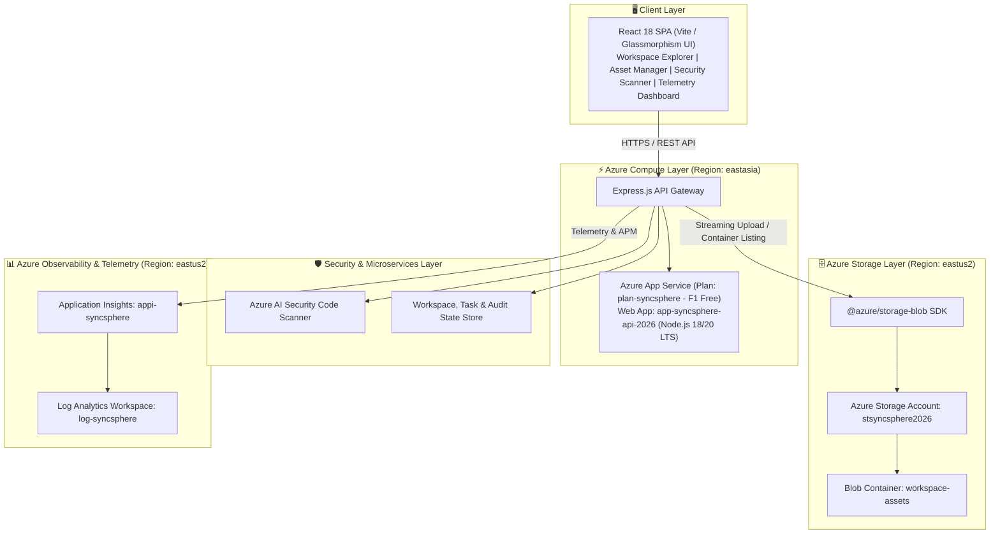

# ☁️ SyncSphere — Azure Cloud Project Collaboration Workspace

[](https://azure.microsoft.com/)
[](https://nodejs.org/)
[](https://reactjs.org/)
[](https://vitejs.dev/)

> **SyncSphere** is a multi-tenant cloud collaboration workspace engineered for cloud computing teams. Built on **Microsoft Azure**, it integrates real-time workspace task tracking, serverless Azure Blob Storage asset management, automated AI cloud security code scanning, and live infrastructure telemetry monitoring.

---

## 🏗️ Cloud System Architecture



---

## 🌩️ Provisioned Azure Infrastructure

| Resource Type | Name | Region | Description |
| :--- | :--- | :--- | :--- |
| **Resource Group** | `rg-syncsphere-eastus2` | `eastus2` | Core container for all SyncSphere resources. |
| **Storage Account** | `stsyncsphere2026` | `eastus2` | Standard_LRS Storage V2 with CORS and HTTPS enforcement. |
| **Blob Container** | `workspace-assets` | `eastus2` | Container for streaming asset uploads/downloads. |
| **Log Analytics** | `log-syncsphere` | `eastus2` | Centralized log ingestion workspace. |
| **Application Insights**| `appi-syncsphere` | `eastus2` | APM performance monitoring & failure tracking. |
| **App Service Plan** | `plan-syncsphere` | `eastasia` | Linux F1 Free Tier compute plan. |
| **Web App** | `app-syncsphere-api-2026` | `eastasia` | Host for Node.js API Gateway & React SPA. |

---

## ✨ Key Features & Capabilities

### 1. 🔑 Passwordless Email Gateway & Identity Session Lock
- Passwordless email authentication gateway for multi-user cloud workspace access.
- Permanent session-verified identity locking (`clientSessionId`), eliminating identity impersonation or unauthorized name modifications.

### 2. 📂 Project Workspaces & Task Manager
- Create and organize cloud computing project workspaces.
- Dynamic task checklist tracker with priority tags (`High`, `Medium`, `Low`) and real-time status.
- Member collaboration avatars and automated assignee attribution.

### 3. 🗄️ Azure Blob Storage Asset Manager
- Direct buffer streaming to Azure Blob Storage container (`workspace-assets`).
- Automatic MIME-type detection and direct SAS / blob URL generation.
- Real-time file deletion and size formatting.

### 4. 🛡️ AI Cloud Security Code Scanner
- Heuristic static code analyzer for cloud configurations and Azure Node.js SDK snippets.
- Audits for hardcoded secrets, unencrypted HTTP protocols, public blob container access, and permissive CORS.
- Computes dynamic **0–100 Security Compliance Scores**.

### 5. 📊 Infrastructure Telemetry & Device-Aware Audit Stream
- Live service health indicators for Azure App Service, Blob Storage, Log Analytics, and Application Insights.
- Device-aware system & security audit event stream (`💻 Desktop` vs `📱 Mobile`) with personalized `(You)` resolution for active sessions.
- In-memory & API-driven audit stream management with warning-level security audit tracking.

---

## 💻 Tech Stack

- **Frontend:** React 18, Vite, Lucide Icons, Glassmorphism CSS Design Tokens
- **Backend:** Node.js, Express.js, `@azure/storage-blob`, `dotenv`, `cors`, `multer`
- **Cloud Infrastructure:** Azure CLI, Azure App Service (F1), Azure Blob Storage, Azure Log Analytics, Application Insights
- **Subscription:** Azure for Students

---

## ⚡ Local Setup & Installation

### Prerequisites
- Node.js (v18+ or v20+)
- npm or yarn
- Azure CLI authenticated (`az login`)

### 1. Clone Repository
```bash
git clone https://github.com/Tirupathi-Reddy-Pucha/SyncSphere.git
cd SyncSphere
```

### 2. Setup Backend
```bash
cd backend
npm install
```

Create a `backend/.env` file with your Azure credentials:
```env
PORT=5000
NODE_ENV=development
AZURE_STORAGE_CONNECTION_STRING=your_azure_storage_connection_string
AZURE_STORAGE_CONTAINER_NAME=workspace-assets
JWT_SECRET=your_jwt_secret_key
```

Start the backend API server:
```bash
npm start
```

### 3. Setup Frontend
```bash
cd ../frontend
npm install
npm run dev
```
Open `http://localhost:3000` in your browser.

---

## 🎓 Academic Context
Developed by **Tirupathi Reddy** (`cb.sc.u4cse23568@cb.students.amrita.edu`) for the **Cloud Computing Course Project** using Microsoft Azure.
